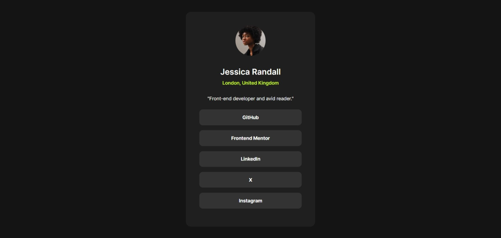

# Frontend Mentor - Social links profile solution

This is a solution to the [Social links profile challenge on Frontend Mentor](https://www.frontendmentor.io/challenges/social-links-profile-UG32l9m6dQ). 

🎉[Live Preview](https://jo-with-vision.github.io/FEM-social-links-profile/) 

## Table of contents

- [Overview](#overview)
- [The challenge](#the-challenge)
- [Screenshot](#screenshot)
- [Author](#author)

## Overview

### The challenge

Users should be able to:

- See hover and focus states for all interactive elements on the page

### Screenshot

## Author
- Frontend Mentor - [@Jo_WithVision](https://www.frontendmentor.io/profile/Jo-with-vision)
